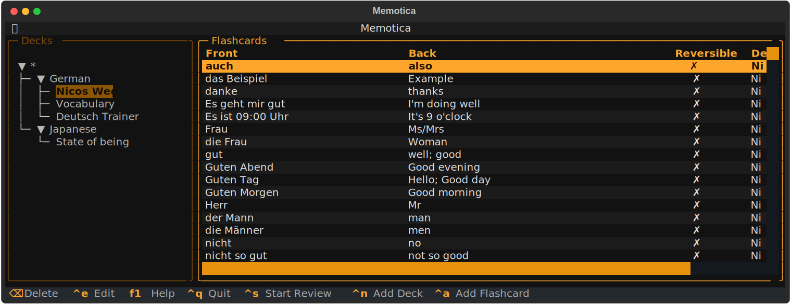
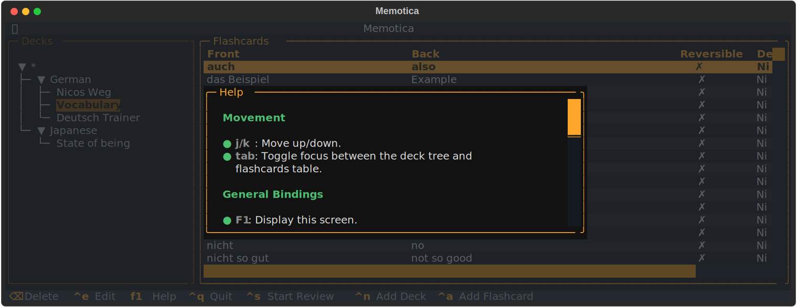
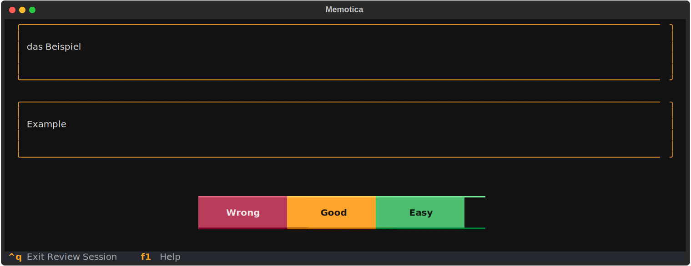

# memotica

An easy, fast, and minimalist space repetition application for the terminal



## Features

- Markdown support for flashcards.
- Support for sub-decks for a better organization.
- Advanced spaced repetition with the SM2 algorithm.
- Keyboard-First navigation.
- Easy to add, edit and delete decks and flashcards.

## WIP

memotica is nearly ready for use, but there are some features that I would like to implement before reaching version `v1.0.0`:

- Customizable space repetition algorithm.
- Import command.
- Interoperability with Anki.
- Better flashcards management.
- Basic statistics.
- Visual indicators.

## Motivation

Recently, I began to study German and a bit of Japanese. At the same time I was also thinking of playing a bit more with [textual](https://textual.textualize.io/). After encountering some issues with the Anki application on Linux, I decided that it would be a great idea to create a similar application more tailored for my needs and usage.

## Screenshots




## Installation

> memotica automatically creates a directory in the most appropriate location based on your operating system. This directory contains a SQLite database where all your decks and flashcards are stored. You can learn more about how this is done [here](https://click.palletsprojects.com/en/8.1.x/api/#click.get_app_dir).

### Using `pip`

```bash
pip install memotica
```

### With `pipx` (recommended)

```bash
pipx install memotica
```

## Usage

Once memotica is installed, you should have the `memotica` command available. To start the TUI simply run:

```bash
memotica
```

Or, if you want to see the help message and other available commands, run:

```bash
memotica --help
```

Once the TUI is displayed, you can:

- **Display the help message** by pressing `F1`.
- **Add a new deck** by pressing `ctrl+n`.
- **Add flashcards** with `ctrl+a`.

After you've added flashcards, select a deck in the deck tree and press `ctrl+s` to begin the review process.

## Help is Welcome

If you have any suggestions or would like to contribute to this project, please feel free to open an issue. Thank for your interest!

## Thanks

I took inspiration and implement various aspects of memotica by reviewing and studying the source code from [harlequin.sh](https://harlequin.sh/).
